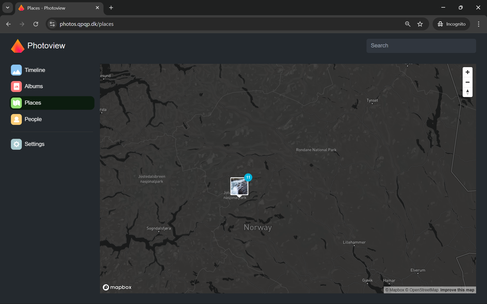

<div align="center">
  
</div>

# PhotoStack AI: Browse Your Life in Pictures
[](https://opensource.org/licenses/MIT)
[](https://fastapi.tiangolo.com)
[](https://reactjs.org/)
[](https://deepmind.google/technologies/gemini/)

**PhotoStack AI** is an intelligent, self-hosted digital asset management system for the privacy-conscious. It uses state-of-the-art AI to tag, organize, and surface your memories automatically, without ever sending your data to the cloud for storage.

<!-- <div align="center">
  
  <p><em>Explore your memories on an interactive map</em></p>
</div> -->

## Feature Overview

**Our mission is to bring the power of Google Photos to your private server.** PhotoStack AI combines industrial-strength database design with modern AI understanding.

*   **🔍 Natural Language Search**: Ask "Show me photos of my dog on the beach" and get instant results.
*   **🏷️ Automatic Tagging**: Google Gemini 2.0 Flash analyzes every image for objects, scenes, and emotions.
*   **🗺️ Interactive Maps**: Visualize your journey with clustered markers and location history.
*   **🔒 Privacy First**: Your photos never leave your server. AI analysis is performed transiently.
*   **📱 Modern & Fast**: Built with React and FastAPI for a snappy, app-like experience on any device.
*   **📸 Broad Support**: Handles HEIC, RAW, and standard formats seamlessly.

## Getting Started

You can run PhotoStack AI at home using Docker. It's designed to be simple to deploy.

```bash
# 1. Clone the repo
git clone https://github.com/yourusername/photostack-ai.git

# 2. Set your API Key (Get one from ai.google.dev)
echo "GEMINI_API_KEY=your_key_here" > .env

# 3. Launch
docker-compose up --build
```

Visit `http://localhost:8000` to start browsing.

## Technical Architecture

PhotoStack AI is built for performance and scalability. Ideal for developers looking to understand modern AI integration.

| Component | Technology | Description |
|-----------|------------|-------------|
| **AI Engine** | Gemini 2.0 + LangChain | Multimodal understanding & structured output |
| **Backend** | FastAPI | High-performance async Python framework |
| **Frontend** | React + Vite | Reactive UI with TypeScript safety |
| **Database** | PostgreSQL | Robust relational data storage |
| **Search** | Semantic + Fuzzy | Two-tier search architecture for accuracy |

> **Note for Recruiters/Developers:** This project serves as a comprehensive portfolio piece demonstrating full-stack architecture, AI integration patterns, and system design.
> [View Architecture Docs ›](docs/architecture.html)

## Support & Community

*   **Documentation**: [Read the Docs](docs/README.md)
*   **Bug Reports**: [Open an Issue](https://github.com/yourusername/photostack-ai/issues)
*   **Discussion**: [Join the Conversation](https://github.com/yourusername/photostack-ai/discussions)

## License

PhotoStack AI is open-source software licensed under the [MIT license](LICENSE).

---
<div align="center">
  <sub>Built with ❤️ by [Your Name] • Powered by Google Gemini</sub>
</div>
