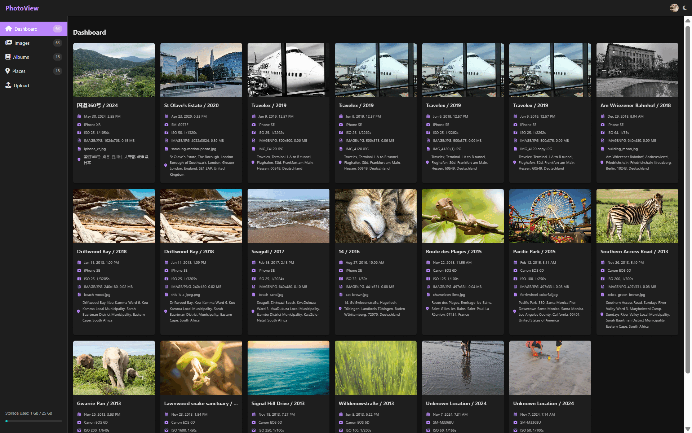

# PhotoStack 

---

**PhotoStack** is a modern, self-hosted photo gallery and management application built with Python and FastAPI. It provides a clean, intuitive, and performant solution for organizing, viewing, and exploring your personal photo collection.

This project is a university-level assignment inspired by the excellent open-source applications [PhotoPrism](https://www.photoprism.app/) and [PhotoView](https://photoview.github.io/). This project serves as a Python-based version, implementing some of their core features. Please see the `CITATIONS.md` file for more details on these inspirations.

---

## ✨ Key Features

### Modern & Responsive User Interface
*   A clean, intuitive UI designed for a seamless user experience.
*   **Theme Support:** Easily switch between a sleek dark mode and a clean light mode.
*   **Responsive Design:** A fully responsive layout that works beautifully on both desktop and mobile devices.

### Intelligent Photo Management
*   **Automatic Metadata Extraction:** On import, the application automatically scans images and extracts EXIF data, including camera model, date taken, resolution, and more.
*   **Automatic Geotagging & Reverse Geocoding:** GPS coordinates are automatically extracted, and human-readable addresses are fetched and stored for each geotagged photo.
*   **HEIC Support:** Seamlessly upload HEIC/HEIF images, which are automatically converted to JPEG while preserving all metadata.

### Dynamic & Engaging Views
*   **Dashboard:** A curated view of your most recent photos, with geotagged images prioritized.
*   **Image Library:** A complete, paginated view of your entire photo collection.
*   **Detailed Image Cards:** Each photo is displayed with its most important metadata at a glance.
*   **Image Lightbox:** A full-screen carousel/lightbox for viewing images in high resolution, complete with keyboard navigation for an immersive experience.

### Powerful Organization Tools

*   **Album Organization:** Photos are automatically grouped by month and year, making it easy to browse your collection chronologically.

*   **Interactive World Map:** Geotagged photos are displayed on a beautiful, interactive world map with custom, clustered image markers, allowing you to explore your photos geographically.

---
