# PhotoStack AI - System Architecture

> **Visual documentation of system design, data flow, and architectural patterns**

---

## 📊 **Database Schema**

### **Entity Relationship Diagram**

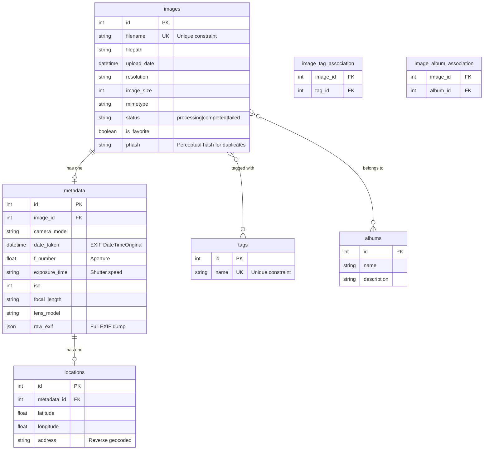

### **Key Relationships**

| Type | Entities | Rationale |
|------|----------|-----------|
| **1:1** | Image → Metadata | Not all images have EXIF; separation keeps `images` table lean |
| **1:1** | Metadata → Location | GPS is optional; location is extension of metadata |
| **M:N** | Images ↔ Tags | One image has multiple tags; one tag applies to many images |
| **M:N** | Images ↔ Albums | One image can be in multiple albums (e.g., "2023 Summer" + "Beach Photos") |

---

## 🏗️ **System Architecture**

### **High-Level Overview**

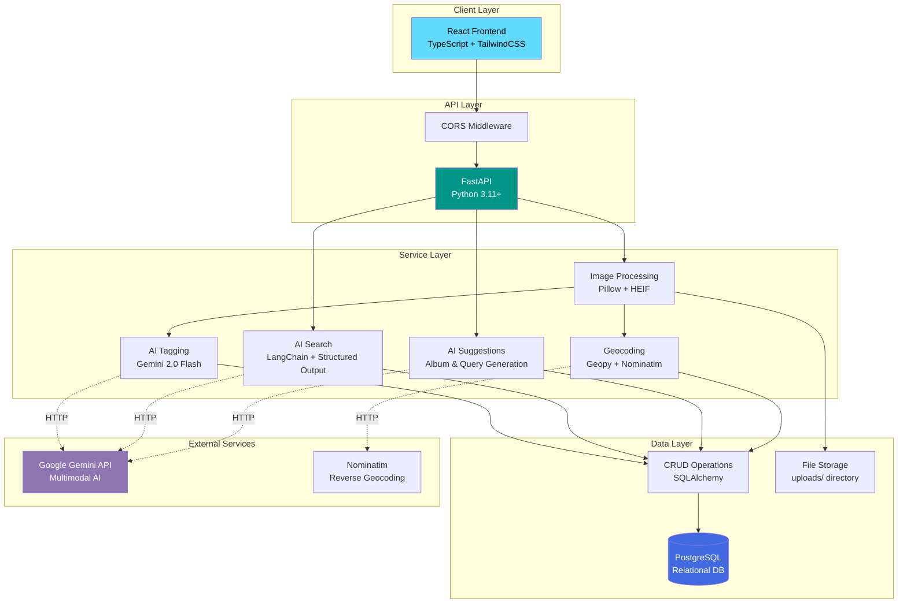

### **Technology Stack Mapping**

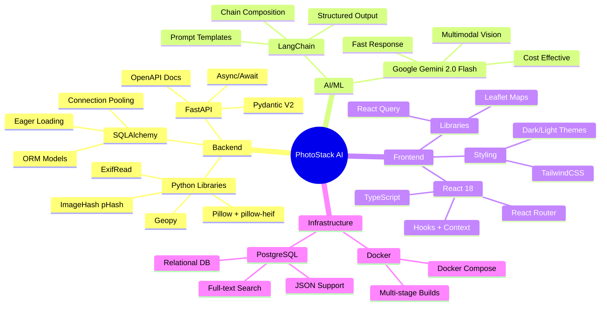

---

## 🔄 **Data Flow Diagrams**

### **Image Upload & Processing Pipeline**

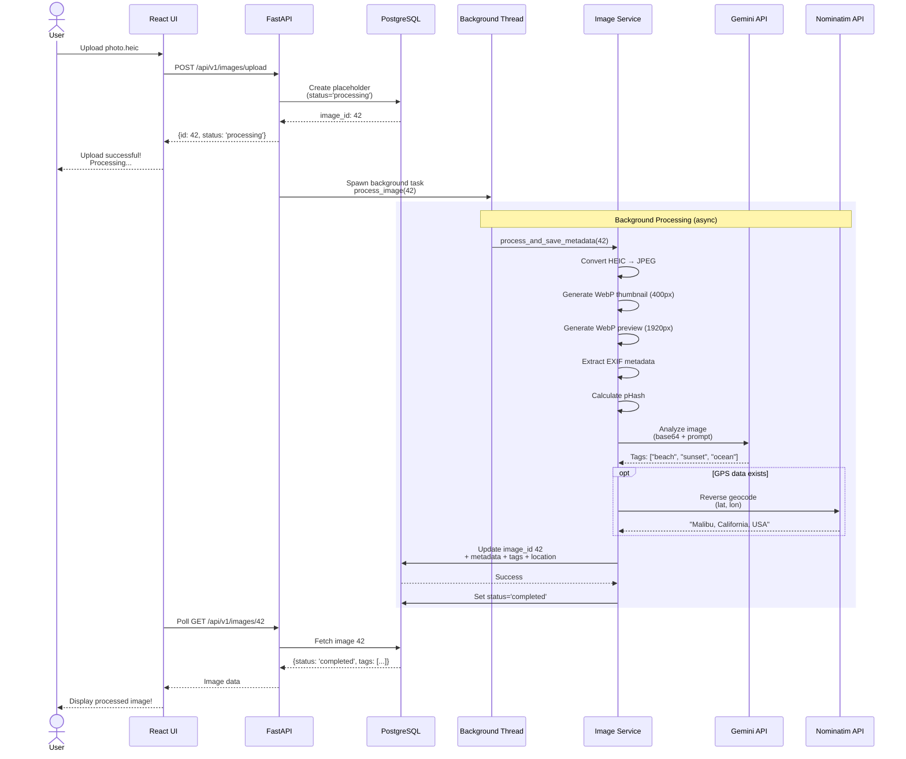

### **AI-Powered Search Flow**

```mermaid
flowchart TD
    A[User Query:<br/>'sunset photos from California in 2023'] --> B{AI Search Service}
    
    B --> C[Tier 1: Structured Extraction]
    C --> D[LangChain + Gemini]
    
    D --> E{Extract Filters}
    E -->|Success| F[SearchQuery Schema:<br/>tags=['sunset']<br/>location='California'<br/>date='2023-01-01 to 2023-12-31']
    E -->|Failed| L[Skip to Tier 2]
    
    F --> G[CRUD: search_by_filters]
    G --> H[SQL Query with JOINs]
    
    H --> I{Results Found?}
    I -->|Yes| J[Return Images]
    I -->|No| K[Tier 2: Keyword Fallback]
    
    L --> K
    K --> M[Remove Stop Words:<br/>'sunset', 'photos', 'California', '2023']
    M --> N[CRUD: search_by_keywords]
    N --> O[SQL with OR conditions<br/>ILIKE across tags/locations]
    O --> J
    
    J --> P[API Response:<br/>List of Image objects]
    
    style D fill:#8E75B2,color:#fff
    style H fill:#4169E1,color:#fff
    style J fill:#28a745,color:#fff
```

### **Album Suggestion Generation**

```mermaid
graph LR
    A[User clicks<br/>'Get Suggestions'] --> B[AI Suggestion Service]
    
    B --> C[Fetch top 100 tags<br/>from database]
    C --> D[Random sample 30 tags<br/>+ shuffle]
    
    D --> E[Build prompt:<br/>'beach 45, sunset 32...']
    E --> F[LangChain Chain:<br/>Prompt → Gemini → Parser]
    
    F --> G{Gemini API<br/>temp=0.8}
    G --> H[Raw response:<br/>JSON string]
    
    H --> I[Parse JSON:<br/>extract 'suggestions' array]
    I --> J[Validate:<br/>4-5 unique titles]
    
    J --> K{Valid?}
    K -->|Yes| L[Return:<br/>['Golden Hour by the Sea',<br/>'Coastal Adventures']]
    K -->|No| M[Fallback:<br/>Generic suggestions]
    
    M --> L
    L --> N[API Response]
    
    style G fill:#8E75B2,color:#fff
    style L fill:#28a745,color:#fff
```

---

## 🧠 **AI Pipeline Architecture**

### **Image Tagging Pipeline**

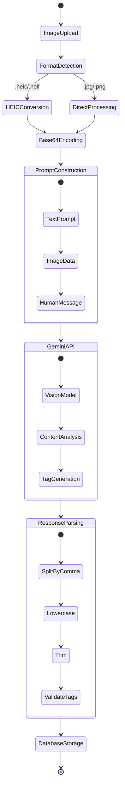

### **Search Query Processing**

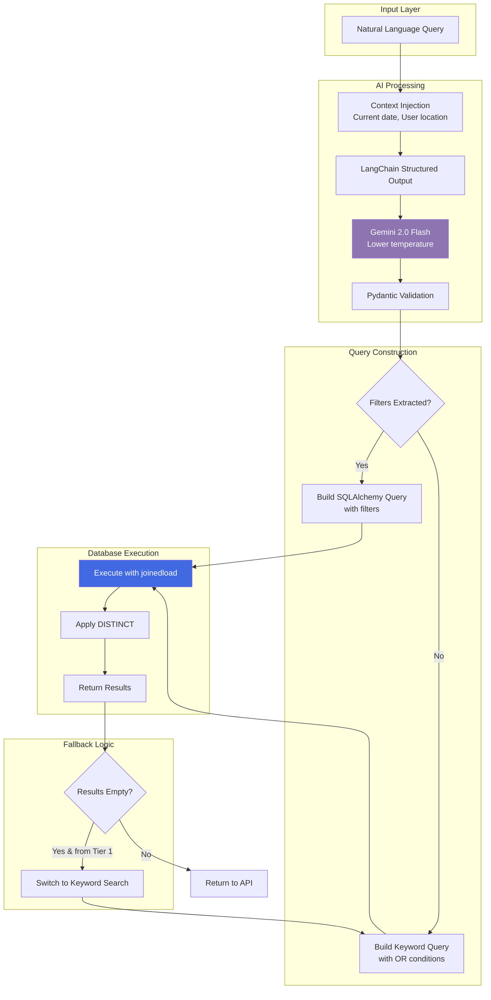

---

## 🔐 **Security & Authentication Flow**

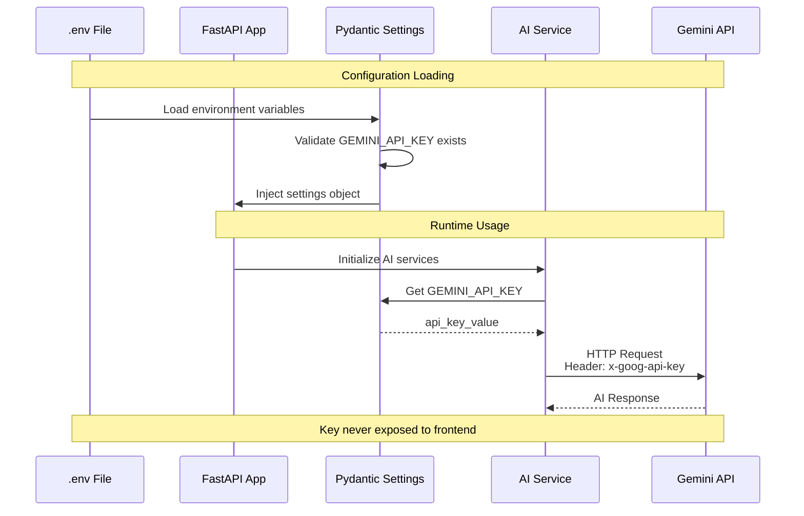

### **Data Privacy Architecture**

```mermaid
graph TB
    subgraph "User's Infrastructure"
        USER[User]
        BROWSER[Web Browser]
        
        subgraph "Docker Container"
            API[FastAPI Server]
            DB[(PostgreSQL)]
            FILES[/uploads/ directory]
        end
        
        USER --> BROWSER
        BROWSER <-->|HTTPS| API
        API <--> DB
        API <--> FILES
    end
    
    subgraph "External Services"
        GEMINI[Google Gemini API]
        NOMINATIM[Nominatim OSM]
    end
    
    API -.->|Image analysis only| GEMINI
    API -.->|Coordinates only| NOMINATIM
    
    style FILES fill:#90EE90,color:#000
    style DB fill:#90EE90,color:#000
    style GEMINI fill:#FFD700,color:#000
    style NOMINATIM fill:#FFD700,color:#000
    
    classDef private fill:#90EE90,color:#000
    classDef external fill:#FFD700,color:#000
    
    Note1[✅ Photos stored locally] -.-> FILES
    Note2[⚠️ Only base64 images sent<br/>Not stored by Google] -.-> GEMINI
```

---

## ⚡ **Performance Optimization**

### **Database Query Optimization**

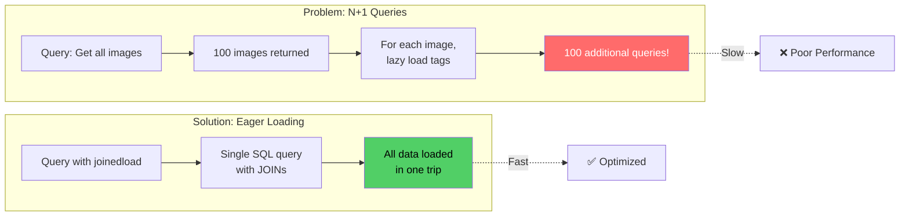

### **Connection Pool Management**

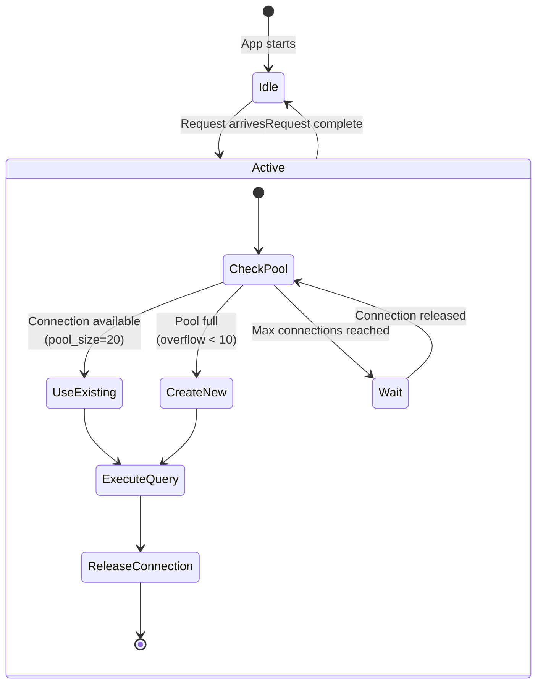

---

## 📦 **Deployment Architecture**

### **Docker Compose Services**

```mermaid
graph TB
    subgraph "docker-compose.yml"
        subgraph "web service"
            API[FastAPI App<br/>Port 8000]
            FILES[/uploads volume mount]
        end
        
        subgraph "db service"
            PG[(PostgreSQL<br/>Port 5432)]
            PGDATA[/var/lib/postgresql/data]
        end
    end
    
    subgraph "Host Machine"
        ENV[.env file<br/>GEMINI_API_KEY]
        UPLOADS[./uploads directory]
    end
    
    ENV -.->|Environment variables| API
    UPLOADS <-->|Volume mount| FILES
    API <-->|TCP/IP| PG
    
    CLIENT[Web Browser] -->|HTTP :8000| API
    
    style PG fill:#4169E1,color:#fff
    style API fill:#009688,color:#fff
```

### **Build & Run Flow**

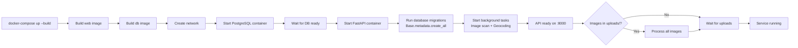

---

## 🧪 **Testing Architecture**

### **Test Coverage Map**

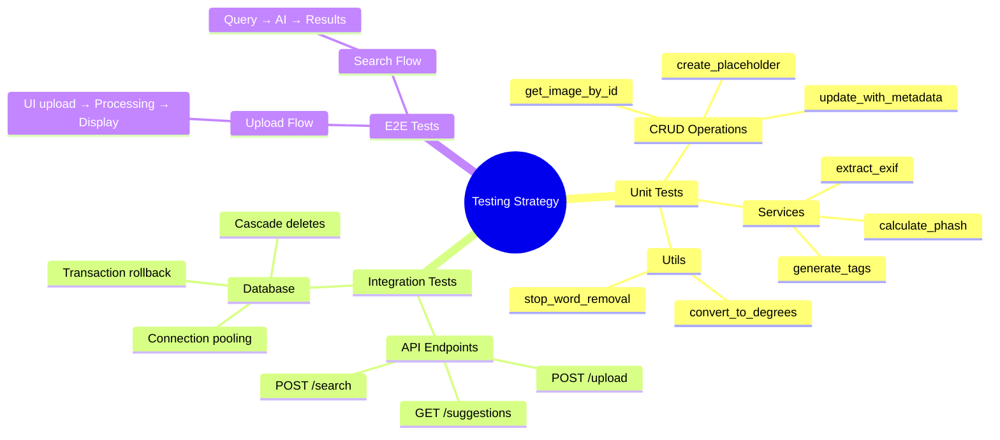

---

## 📐 **Code Organization**

### **Backend Module Structure**

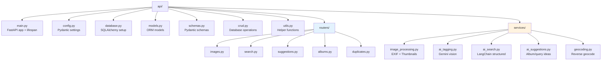

---

## 🔄 **State Management**

### **Image Processing States**

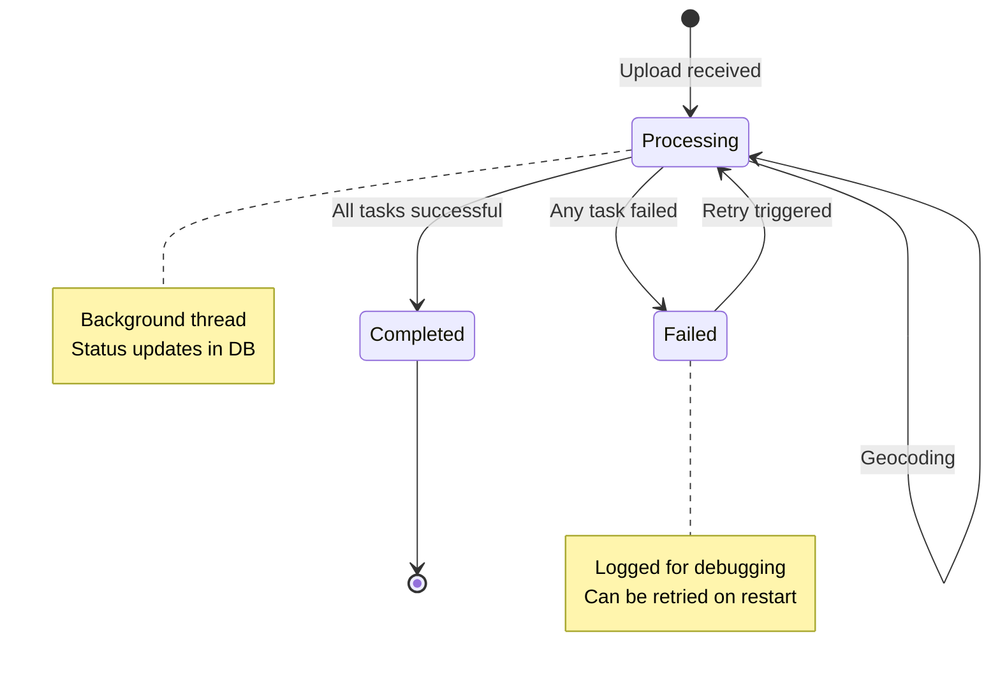

---

## 📊 **Metrics & Monitoring**

### **Key Performance Indicators**

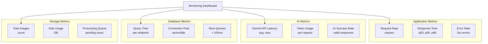

---

## 🎯 **Design Patterns**

### **Repository Pattern**

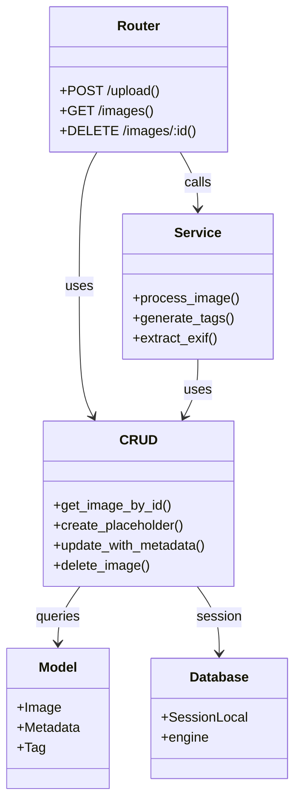

---

This comprehensive architecture documentation provides visual clarity on every aspect of PhotoStack AI's design. Use these diagrams in presentations, documentation, and technical discussions! 🚀
